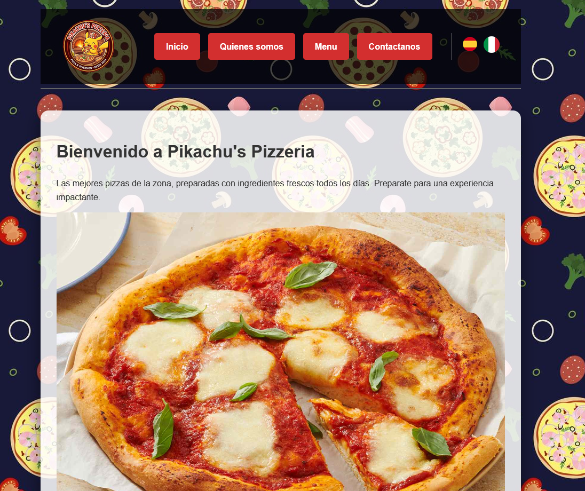
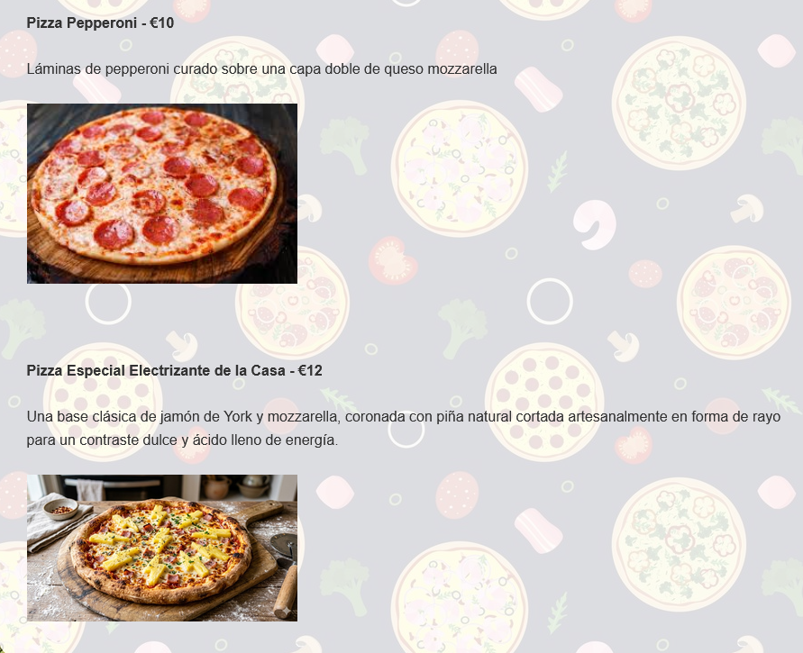

# Pikachu's Pizzeria — Sitio web de ejemplo

**Un sitio web multipágina para una pizzería local**, desarrollado como el primer proyecto de una práctica formativa Erasmus+. Demuestra fundamentos de desarrollo web: includes del lado del servidor, contenido bilingüe y maquetación CSS limpia.

> **Idioma:** Español | [English](README.md)

---

## Contexto del proyecto

|              |                                                                          |
| ------------ | ------------------------------------------------------------------------ |
| **Autor**    | Miguel Eduardo Marcano Ordaz                                             |
| **Contexto** | Práctica formativa Erasmus+ en TR Consulting Group (TR CONSULTINGROUP SRL), Avezzano, Italia — **proyecto #1 de 4** (complejidad creciente) |
| **Rol**      | Técnico en Software (becario a tiempo completo)                          |
| **Año**      | 2026                                                                     |
| **Idiomas**  | Español (predeterminado) e italiano                                      |

---

## Capturas de pantalla





---

## Descripción general

Pikachu's Pizzeria es un sitio multipágina estático que simula un pequeño negocio local. Fue el punto de entrada de la progresión web de la práctica (pizzería → biblioteca → alquiler de propiedades → SaaS clínico MVP) y se centra en lo esencial: includes PHP reutilizables, interfaz en dos idiomas y CSS escrito a mano sin framework.

| Área                     | Detalles                                                                     |
| ------------------------ | --------------------------------------------------------------------------- |
| **Páginas**              | Inicio, Quiénes somos, Menú y Contacto                                      |
| **Backend**              | PHP con includes reutilizables (`header.php`, `footer.php`)                 |
| **Internacionalización** | Español (predeterminado) e italiano mediante `?lang=es` / `?lang=it`        |
| **Estilos**              | CSS personalizado con layout, tipografía, efectos hover y estilos de formulario |
| **Formularios**          | Formulario de contacto con validación HTML5 (`required`, `email`, `select`, `textarea`) |
| **Contenido**            | Contenido estático de negocio: historia, valores, menú con imágenes, datos de contacto |

---

## Características

- **PHP** — includes del lado del servidor, renderizado condicional y año dinámico en el pie de página
- **HTML5** — estructura semántica (`header`, `nav`, `main`, `section`, `footer`), etiquetas accesibles y elementos de formulario
- **CSS3** — layout con Flexbox, gradientes, transiciones, estados de foco y sección de contacto responsive (`flex-wrap`)
- **Estructura del proyecto** — separación de layout (header/footer), estilos y contenido de página en varios archivos
- **Fundamentos de i18n** — cambio de idioma sin framework, preservando la navegación entre páginas
- **UX** — navegación clara, jerarquía visual y un layout práctico para el formulario de contacto

---

## Stack tecnológico

| Capa                 | Tecnología                                      |
| -------------------- | ----------------------------------------------- |
| Backend              | PHP (sin framework)                             |
| Frontend             | HTML5, CSS3                                     |
| Internacionalización | Cambio de idioma por parámetro de consulta (`?lang=`) |
| Servidor local       | Servidor integrado de PHP                       |

---

## Estructura del proyecto

```
sitio-web-offline/
├── index.php           # Página de inicio
├── quienes-somos.php   # Quiénes somos
├── servicios.php       # Menú
├── contacto.php        # Formulario de contacto e info del negocio
├── header.php          # Cabecera y navegación compartidas
├── footer.php          # Pie de página compartido
├── style.css           # Estilos globales
└── imagenes/           # Logo, banderas, fondos e imágenes de pizzas
```

---

## Primeros pasos

Requiere PHP instalado en tu máquina.

```bash
cd sitio-web-offline
php -S localhost:8000
```

Luego abre [http://localhost:8000](http://localhost:8000) en tu navegador.

Cambia el idioma con los iconos de bandera en la barra de navegación, o añade `?lang=it` / `?lang=es` a cualquier URL.

**Notas**

- Es un **proyecto de ejemplo estático** — el formulario de contacto no envía correos ni persiste datos.
- Las imágenes están incluidas localmente para que el sitio funcione completamente offline.

---

## Autor

**Miguel Eduardo Marcano Ordaz**

|          |                                                                                           |
| -------- | ----------------------------------------------------------------------------------------- |
| GitHub   | [github.com/memomiguel](https://github.com/memomiguel)                                    |
| LinkedIn | [Miguel Eduardo Marcano Ordaz](https://www.linkedin.com/in/miguel-eduardo-marcano-ordaz/) |
| Email    | [memomiguel@proton.me](mailto:memomiguel@proton.me)                                       |

---

## Licencia

Publicado bajo la **Licencia MIT**. Consulta [LICENSE](LICENSE) para más detalles.
